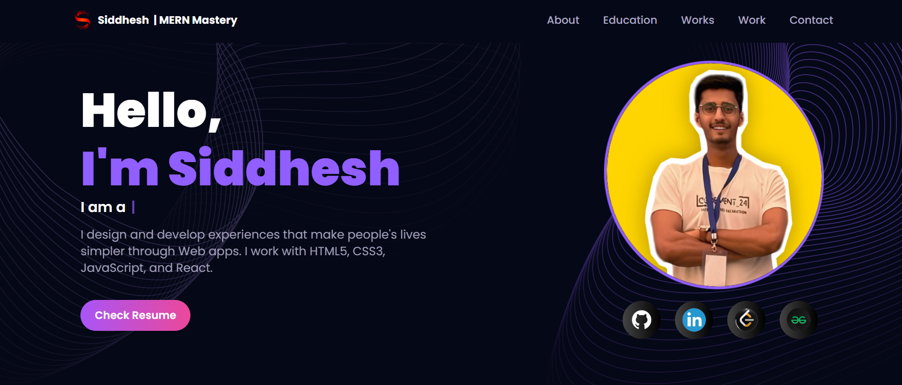
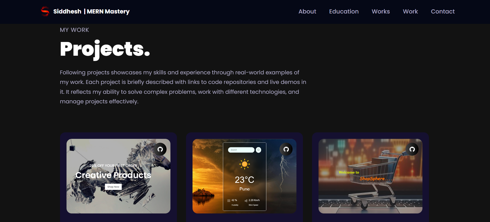
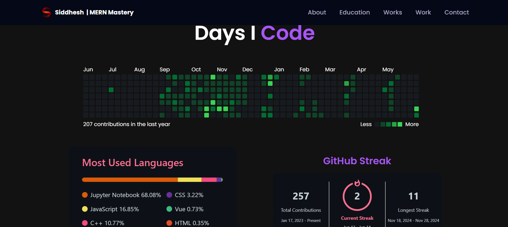

# 💼 Developer Portfolio

A modern, responsive, and visually engaging portfolio built with **React.js**, showcasing 3D visuals, interactive UI, and personal projects. Designed to demonstrate frontend and backend web development skills using current industry standards.

## 🚀 Features

- 3D Hero Section using **Three.js**, **React Three Fiber**, and **Drei**
- Responsive design with **Tailwind CSS** and **Bootstrap**
- Smooth animations and transitions using **Framer Motion**
- Contact form with real-time submission via **EmailJS**
- Clean, component-based architecture using **React SPA**
- Performance-optimized build setup with **Vite**

## 🛠️ Tech Stack

- **Frontend:** React.js, Tailwind CSS, Bootstrap
- **3D & Animation:** Three.js, React Three Fiber, Drei, Framer Motion
- **Utilities:** EmailJS (form handling), Vite (build tool)

## 📁 Project Structure
```bash
portfolio/
├── public/
│ ├── assets/ 
│ └── screenshots/
├── src/
│ ├── components/ 
│ ├── pages/ 
│ ├── App.jsx 
│ └── main.jsx 
├── index.html
├── tailwind.config.js
├── vite.config.js
└── README.md
```

### Screenshot








## 🛠️ Setup Instructions

1. **Clone the repository**
```bash
git clone https://github.com/Siddhesh672004/portfolio.git
cd portfolio
```

2. Install dependencies
```bash
npm install
```

3. Run the development server
```bash
npm run dev
```

5. Build for production
```bash
npm run build
```

#### [🚀 View Live Demo](https://siddhesh-chaudhari.web.app/)


