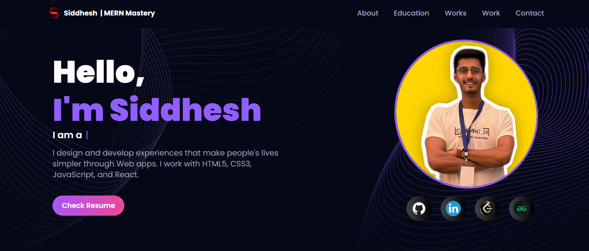
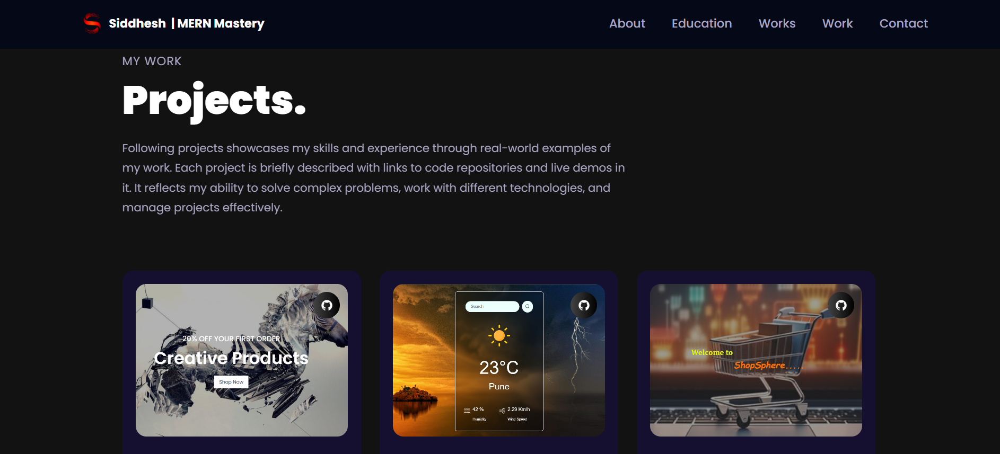
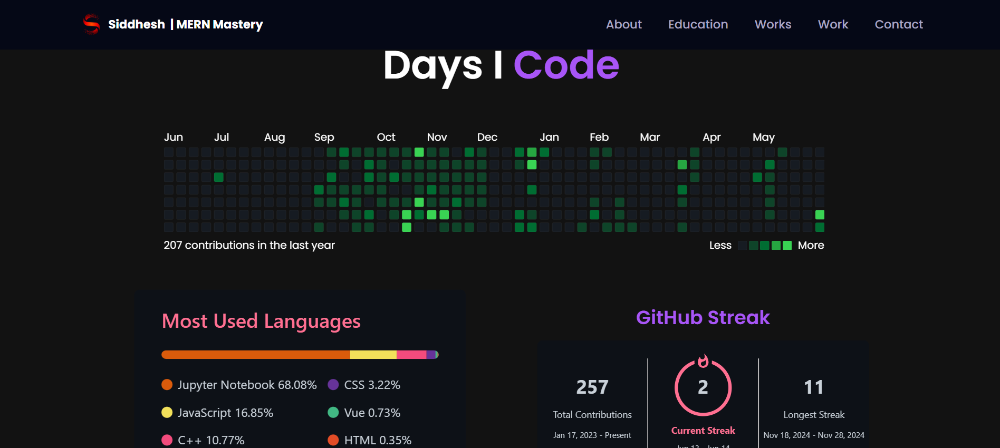

<div align="center">

<a href="https://siddhesh-chaudhari.web.app/">
  
</a>

# Siddhesh Chaudhari — Developer Portfolio

### A 3D, animation-rich personal portfolio built with React, Three.js & Framer Motion

[](https://siddhesh-chaudhari.web.app/)
[](https://react.dev/)
[](https://vitejs.dev/)
[](#license)
[](#contributing)


[**Live Demo**](https://siddhesh-chaudhari.web.app/) · [**Report Bug**](https://github.com/Siddhesh672004/portfolio/issues) · [**Request Feature**](https://github.com/Siddhesh672004/portfolio/issues)

</div>

---

## About The Project

This is the source code for my personal developer portfolio — a fully responsive, animation-driven single-page application that showcases my work, education, experience, certifications, hackathons and a real-time GitHub contribution graph. It uses **WebGL-rendered 3D scenes**, scroll-triggered motion and a working contact form, all bundled by Vite and deployed on Firebase Hosting.

The site is designed to be more than a resume: every section is a reusable React component, every interaction is animated with [Framer Motion](https://www.framer.com/motion/), and the technology stack is rendered as floating 3D balls using `@react-three/fiber`.

> **Live:** [siddhesh-chaudhari.web.app](https://siddhesh-chaudhari.web.app/)

### Preview

<p align="center">
  
  <br /><em>Hero section — animated avatar, typewriter role, social CTAs</em>
</p>

<p align="center">
  
  <br /><em>Projects grid with tilt cards and source-code links</em>
</p>

<p align="center">
  
  <br /><em>Live GitHub contribution calendar + language stats</em>
</p>

---

## Highlights

- **Immersive 3D scenes** — Hero computer model, rotating Earth, animated star-field background and floating tech balls rendered with [Three.js](https://threejs.org/) via [`@react-three/fiber`](https://docs.pmnd.rs/react-three-fiber) and [`@react-three/drei`](https://github.com/pmndrs/drei).
- **Mobile-aware fallback** — The Tech section detects mobile viewports and swaps heavy 3D balls for static icons to preserve performance on low-power devices.
- **Live GitHub contribution graph** — Real-time activity calendar via [`react-github-calendar`](https://github.com/grubersjoe/react-github-calendar) plus top-languages and streak cards.
- **Working contact form** — Direct email delivery powered by [EmailJS](https://www.emailjs.com/) — no backend required.
- **Visitor counter** — Persistent visitor tracking via [counterapi](https://www.npmjs.com/package/counterapi).
- **Animated certification carousel** — Touch/swipe-enabled, hover-flip cards revealing the actual certificate image (10 certifications from Oracle, Forage, Sumago, Data Planet, Info Planet & Softaid).
- **Vertical timelines** — Education and experience presented through [`react-vertical-timeline-component`](https://github.com/stephane-monnot/react-vertical-timeline).
- **Hackathons showcase** — Includes Smart India Hackathon 2023 & 2024, Rota Tank 2.0 and Codement, with deep-links to LinkedIn posts.
- **SEO-ready** — Open Graph & Twitter card meta, [sitemap.xml](public/sitemap.xml), [robots.txt](public/robots.txt) and Google Search Console verification baked into [index.html](index.html).
- **PWA manifest** — Installable as a standalone app via [public/manifest.json](public/manifest.json).

---

## Built With

**Core**


**3D & Animation**


**Backend & Services**


**Notable Libraries**

| Library | Purpose |
| --- | --- |
| [`@react-three/drei`](https://github.com/pmndrs/drei) | Helpers for `useGLTF`, `OrbitControls`, `Preload` |
| [`maath`](https://github.com/pmndrs/maath) | Math utilities for the random Stars point cloud |
| [`react-parallax-tilt`](https://www.npmjs.com/package/react-parallax-tilt) / [`react-tilt`](https://www.npmjs.com/package/react-tilt) | Card hover-tilt effects |
| [`typewriter-effect`](https://www.npmjs.com/package/typewriter-effect) | Animated role typing in the Hero |
| [`react-vertical-timeline-component`](https://www.npmjs.com/package/react-vertical-timeline-component) | Education & Experience timelines |
| [`react-github-calendar`](https://www.npmjs.com/package/react-github-calendar) | Live contribution graph |
| [`react-router-dom`](https://reactrouter.com/) | Client-side routing |
| [`@heroicons/react`](https://heroicons.com/) | Icon set |

---

## Interesting Techniques

A few patterns inside this codebase that may be useful as references:

- **Higher-Order Section Wrapper** — [src/hoc/SectionWrapper.jsx](src/hoc/SectionWrapper.jsx) wraps every section with a `motion.section`, applies a `staggerContainer` variant and injects an anchor `<span>` so navbar [hash links](https://developer.mozilla.org/en-US/docs/Web/HTML/Element/a#href) scroll smoothly to each section. This eliminates animation boilerplate across 8+ sections.
- **GLTF model loading with Suspense** — [src/components/canvas/Computers.jsx](src/components/canvas/Computers.jsx) and `Earth.jsx` use [`useGLTF`](https://github.com/pmndrs/drei#usegltf) inside a [`<Suspense>`](https://react.dev/reference/react/Suspense) boundary, with a custom `CanvasLoader` that surfaces progress via Drei's `Html` + `useProgress`.
- **Adaptive rendering** — Components subscribe to a [`window.matchMedia`](https://developer.mozilla.org/en-US/docs/Web/API/Window/matchMedia)-style listener and downgrade to static images on mobile viewports ([src/components/Tech.jsx](src/components/Tech.jsx), [src/components/canvas/Computers.jsx](src/components/canvas/Computers.jsx)).
- **Touch-swipe carousel** — [src/components/About.jsx](src/components/About.jsx) implements a custom carousel using the [Touch Events API](https://developer.mozilla.org/en-US/docs/Web/API/Touch_events) (`onTouchStart` / `onTouchMove` / `onTouchEnd`) with a 50px swipe threshold — no carousel library required.
- **Scroll-triggered viewport animations** — Each section uses Framer Motion's [`whileInView`](https://www.framer.com/motion/scroll-animations/) with `viewport={{ once: true }}` so animations fire once on first reveal.
- **Environment-driven contact form** — [src/components/Contact.jsx](src/components/Contact.jsx) reads `VITE_EMAILJS_*` keys via [`import.meta.env`](https://vitejs.dev/guide/env-and-mode.html), keeping secrets out of the bundle.
- **CSS-driven hero glow** — A pure-CSS animated grid layered behind the avatar via custom utility classes (`hero-grid`, `hero-ring`, `hero-pulse`).
- **Tailwind purge + custom theme** — [tailwind.config.js](tailwind.config.js) defines bespoke colors (`primary`, `secondary`, `tertiary`, `black-100`), shadows and a `hero-pattern` background image, all tree-shaken at build time.

---

## Project Structure

```text
portfolio/
├── public/
│   ├── desktop_pc/         # GLTF model + textures for the hero computer
│   ├── planet/             # GLTF model + textures for the rotating Earth
│   ├── manifest.json       # PWA manifest
│   ├── robots.txt
│   └── sitemap.xml
├── src/
│   ├── assets/
│   │   ├── certifications/ # Certificate images (Oracle, Forage, Sumago, etc.)
│   │   ├── company/        # Experience logos
│   │   ├── Hackathons/     # Hackathon photos
│   │   └── tech/           # Tech-stack icons
│   ├── components/
│   │   ├── canvas/         # Three.js scenes — Computers, Earth, Stars, Ball
│   │   ├── About.jsx       # Services + animated certification carousel
│   │   ├── Contact.jsx     # EmailJS-powered form + Earth scene
│   │   ├── Educaion.jsx
│   │   ├── Experience.jsx  # Vertical timeline of jobs
│   │   ├── Github.jsx      # Contribution calendar + GitHub stats cards
│   │   ├── Hackathons.jsx
│   │   ├── Hero.jsx        # Avatar, typewriter, social CTAs
│   │   ├── Navbar.jsx
│   │   ├── Tech.jsx        # 3D balls (desktop) / icons (mobile)
│   │   ├── VisitorCounter.jsx
│   │   └── Works.jsx       # Project showcase grid
│   ├── constants/          # Single source of truth for data (projects, certs…)
│   ├── hoc/                # SectionWrapper HOC
│   ├── utils/              # Framer Motion variants
│   ├── styles.js           # Reusable Tailwind class strings
│   ├── App.jsx
│   └── main.jsx
├── firebase.json           # Firebase Hosting config
├── vite.config.js
├── tailwind.config.js
└── eslint.config.js
```

**Directory notes**
- [public/desktop_pc/](public/desktop_pc/) and [public/planet/](public/planet/) — Third-party GLTF assets; license files included in each folder.
- [src/components/canvas/](src/components/canvas/) — All [WebGL](https://developer.mozilla.org/en-US/docs/Web/API/WebGL_API) scenes are isolated here so the rest of the UI tree stays free of `<Canvas>` boundaries.
- [src/constants/index.js](src/constants/index.js) — Edit this single file to update projects, certifications, education and experience.

---

## Getting Started

### Prerequisites

- **Node.js** ≥ 18
- **npm** (or `pnpm` / `yarn`)
- An **EmailJS** account with a service + template if you want the contact form to send mail

### Installation

```bash
git clone https://github.com/Siddhesh672004/portfolio.git
cd portfolio
npm install
```

### Environment Variables

Create a `.env` file in the project root:

```env
VITE_EMAILJS_SERVICE_ID=your_service_id
VITE_EMAILJS_TEMPLATE_ID=your_template_id
VITE_EMAILJS_PUBLIC_KEY=your_public_key
```

> Vite only exposes variables prefixed with `VITE_` to the client — see the [Vite env docs](https://vitejs.dev/guide/env-and-mode.html).

### Available Scripts

| Command | Action |
| --- | --- |
| `npm run dev` | Start the Vite dev server with HMR |
| `npm run build` | Build production assets into `dist/` |
| `npm run preview` | Serve the production build locally |
| `npm run lint` | Run ESLint across the project |

### Deployment

The project is configured for **Firebase Hosting** via [firebase.json](firebase.json):

```bash
npm run build
firebase deploy
```

`dist/` is served as the public root with SPA rewrites that point all routes to `/index.html`.

---

## Customizing the Portfolio

To make this portfolio your own, focus on these files:

- [src/constants/index.js](src/constants/index.js) — Projects, certifications, education, experience, technologies
- [src/assets/](src/assets/) — Replace images, logos, certificates and the resume PDF
- [src/components/Hero.jsx](src/components/Hero.jsx) — Name, tagline, social links, avatar
- [src/components/Hackathons.jsx](src/components/Hackathons.jsx) — Hackathon entries (data is co-located with the component)
- [src/components/Github.jsx](src/components/Github.jsx) — GitHub username for the contribution calendar
- [index.html](index.html) — `<title>`, meta tags, Open Graph image

---

## Connect

<div align="left">

[](https://github.com/Siddhesh672004)
[](https://www.linkedin.com/in/siddhesh-chaudhari-117551294/)
[](https://leetcode.com/u/Siddhesh_Chaudharii/)
[](https://www.geeksforgeeks.org/user/siddheshsgmr/)

</div>

---

## Contributing

Contributions, issues and feature requests are welcome.

1. Fork the repo
2. Create your feature branch (`git checkout -b feat/amazing-thing`)
3. Commit your changes (`git commit -m "feat: add amazing thing"`)
4. Push to the branch (`git push origin feat/amazing-thing`)
5. Open a Pull Request

---

## License

Distributed under the MIT License.

3D models in [public/desktop_pc/](public/desktop_pc/) and [public/planet/](public/planet/) are governed by their own license files included in those folders.

---

<div align="center">

Built with care by **[Siddhesh Chaudhari](https://github.com/Siddhesh672004)** · B.Tech AI & Data Science, DYPIEMR Pune

⭐ If you found this useful, consider starring the repo

</div>
